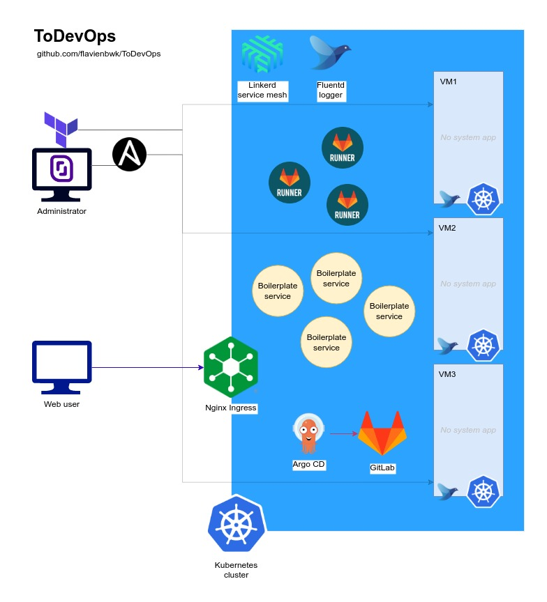

# ToDevOps

A basic thus state-of-the-art architecture to start your modern DevOps stack learning.

:warning: Stage : **alpha** (under active development, for testing only)



## Stack

- Terraform : instanciate 3 VMs on Scaleway
- Ansible : install and configure those VMs (K8S cluster, GitLab, API...)
- Kubernetes : Softwares orchestration
  - Ingress : Cluster endpoint using domains
  - Linkerd : Service mesh for monitoring network & system metrics
  - Fluentd : Operator for capturing apps logs to an Elasticsearch cluster
  - ArgoCD : Infrastructure as Code (IaC) tool to fetch your apps
  - OpenEBS : Simplified storage
- GitLab : registries, runners (CI/CD)
- ReactJS Flask [boilerplate](https://github.com/flavienbwk/reactjs-flask-ldap-boilerplate) : an example of micro-services project

Basically, we're going to get our _boilerplate_ continuously deployed by _ArgoCD_ from a _GitLab_ repository in a _Kubernetes_ cluster of 3 baremetal _Ansible_-installed nodes on _Terraform_-instanciated VMs. _Linkerd_ will monitor network issues and _Fluentd_ capture containers logs into an Elasticsearch instance.

## Deploy

This section explains how to run this infrastructure from your local computer.

I assume you have [Terraform](https://www.terraform.io/downloads) and [Ansible](https://docs.ansible.com/ansible/latest/installation_guide/intro_installation.html) installed and ready on your computer.

### 1. Instanciating the infrastructure

We'll use [Scaleway](https://www.scaleway.com/en/) as a cloud provider. We recommend at least 3 VMs with 8G RAM.

1. Go to your Scaleway account > [Credentials](https://console.scaleway.com/project/credentials) and create a new API key `ToDevOps`

2. Run the following `export` commands replacing values by yours

    ```bash
    export TF_VAR_SCW_PROJECT_ID="my-project-id"
    export TF_VAR_SCW_ACCESS_KEY="my-access-key"
    export TF_VAR_SCW_SECRET_KEY="my-secret-key"
    ```

3. Make sure there's no error by running init and plan commands

    ```bash
    cd ./plans

    terraform init
    terraform plan
    ```

4. Execute the plan

    ```bash
    terraform apply
    ```

5. Edit values of our Ansible inventory file from Terraform output values

    ```bash
    # Install JSON parser
    sudo apt install -y jq

    # Retrieve and set appropriate values
    terraform output -json > terraform_values.json
    cd ..
    bash terraform_to_ansible_values.sh
    ```

### 2. Deploying infrastructure services

This step is about deploying our Kubernetes cluster and its different services as well as GitLab.

:information_source: These roles are idempotent, meaning you can re-run them again and again to reach the expected state

1. Make sure `./inventories/scaleway.ini` values are valid

2. Edit values accordingly to your infrastructure in `./vars/scaleway.yml` (may be unchanged)

3. For setting-up local server domains, run the following command

    ```bash
    ansible-playbook -i inventories/scaleway.ini ./set_local_hosts.yml --extra-vars @./vars/scaleway.yml --ask-become-pass
    ```

4. Run the install

    ```bash
    # Install DNS, Docker and kubectl utils
    ansible-playbook -i inventories/scaleway.ini ./playbooks/infrastructure.yml -t base --extra-vars @./vars/scaleway.yml

    # Setup K8S control plane and nodes
    ansible-playbook -i inventories/scaleway.ini ./playbooks/infrastructure.yml -t k8s-setup --extra-vars @./vars/scaleway.yml

    # Install GitLab on Kubernetes
    # https://gitlab.todevops.local/ (username: root, default password: mySuperSecurePassword)
    ansible-playbook -i inventories/scaleway.ini ./playbooks/infrastructure.yml -t k8s-gitlab --extra-vars @./vars/scaleway.yml

    # Install Linkerd on Kubernetes
    # http://linkerd.todevops.local/ (username: admin, default password: admin)
    ansible-playbook -i inventories/scaleway.ini ./playbooks/infrastructure.yml -t k8s-linkerd --extra-vars @./vars/scaleway.yml

    # Install Fluentd, Elasticsearch & Kibana on Kubernetes
    # http://kibana.todevops.local/ (no authentication)
    ansible-playbook -i inventories/scaleway.ini ./playbooks/infrastructure.yml -t k8s-logging --extra-vars @./vars/scaleway.yml

    # Install ArgoCD on Kubernetes
    # https://argocd.todevops.local/ (username: admin, default password: mySuperSecurePassword)
    ansible-playbook -i inventories/scaleway.ini ./playbooks/infrastructure.yml -t k8s-argocd --extra-vars @./vars/scaleway.yml
    ```

5. (optional) Improve security by removing unrelevant Ingresses

    We're here exposing Linkerd, Fluentd's Kibana and ArgoCD UI through ingresses for convenience. This is NOT recommended : you might want to use the `kubectl port-forward` command to reach your services.

    E.g: `kubectl port-forward -n linkerd-viz svc/web 8080:8084` on your K8S-authenticated VM and then `ssh -L 8080:localhost:8080 root@<VM-IP>` on your computer.

    ```bash
    kubectl delete ingress -n linkerd-viz web-ingress
    kubectl delete ingress -n kube-logging kibana-ingress
    kubectl delete ingress -n argocd argocd-ingress
    ```

### 3. Setting up continuous deployment (CD)

Now our infrastructure is set-up and ready, we're going to setup ArgoCD so it deploys our [repo](https://github.com/flavienbwk/reactjs-flask-ldap-boilerplate) from our GitLab instance.

1. Run the setup

    ```bash
    # Registers SSH keys to "root" GitLab account
    ansible-playbook -i inventories/scaleway.ini ./playbooks/setup-continuous-deployment.yml -t import-repository --extra-vars @./vars/scaleway.yml --extra-vars "gitlab_password={{ gitlab_root_password }}"

    # Configure ArgoCD for our repository
    ansible-playbook -i inventories/scaleway.ini ./playbooks/setup-continuous-deployment.yml -t configure-argocd-repository --extra-vars @./vars/scaleway.yml --extra-vars "gitlab_user=root"
    ```

## Why this repo ?

As I trust DevOps for being able to deeply transform small or big organizations in order to deliver quickly and more reliably, I am currently (2022) transitionning from software to DevOps engineering. This repository compiles my current knowledge on which and how DevOps technologies can be deployed to allow an IT team to work efficiently.

## Found this repo useful ?

Please consider leaving a **star**, sharing improvements with **pull requests** or [**sponsoring**](https://github.com/sponsors/flavienbwk) me.

## Suggestions & feedbacks

Feel free to make your expertise shine [by creating an issue](https://github.com/flavienbwk/ToDevOps/issues/new?assignees=&labels=&template=suggestion-or-feedback.md&title=%5BSUGGESTION%5D+) describing how to keep this repo state-of-the-art. I am extremely open to suggestions.

## Credits

- @[verovec](https://github.com/verovec) for Ingress, Linkerd and Fluentd configurations :tada:

## More resources for your career in DevOps

- https://sre.google/books
- https://www.google.com/books/edition/Building_Secure_and_Reliable_Systems/Kn7UxwEACAAJ
- https://www.coursera.org/professional-certificates/sre-devops-engineer-google-cloud
- https://www.cloudskillsboost.google/quests/141?locale=fr
- DoD's [Platform One](https://software.af.mil/team/platformone/)
